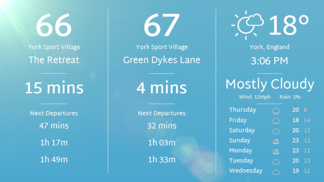
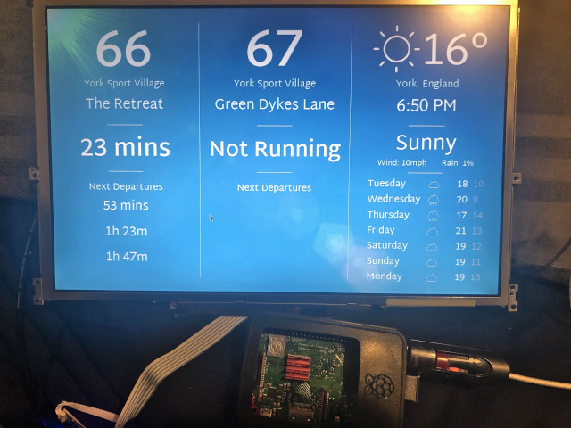
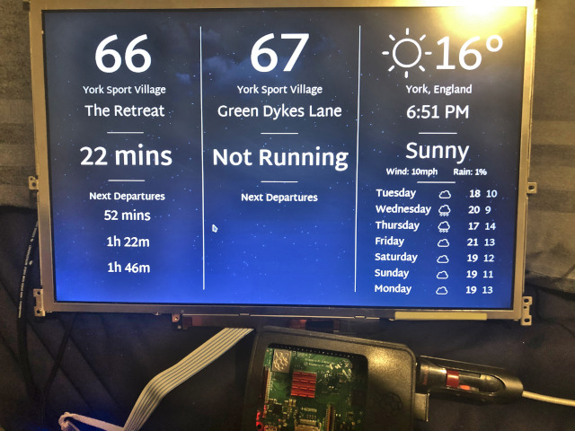
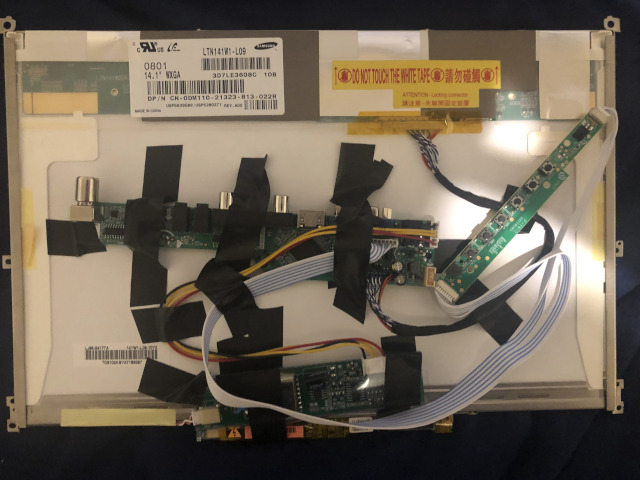
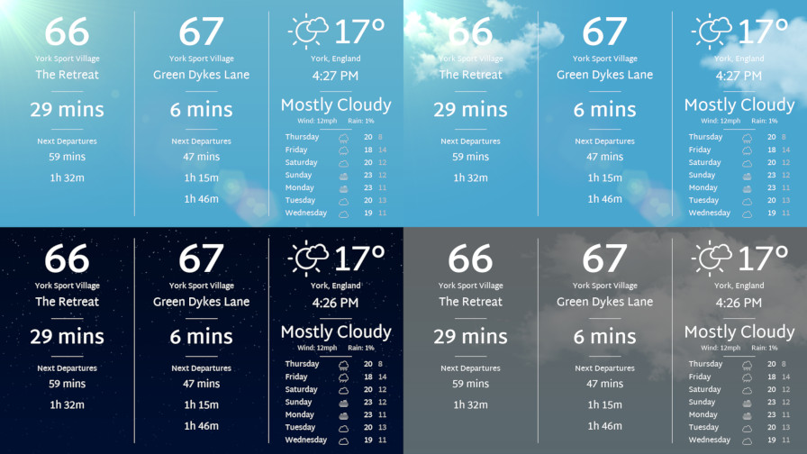
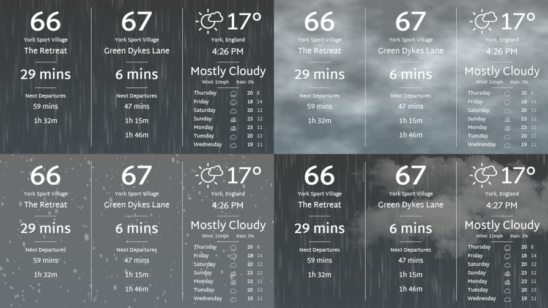

# Bus and Weather App

An application running in Pygame to display real time bus data and weather information, along with live weather animations.

I needed a solution to view the two available bus times from my house, along with the weather, without needing to check my phone and scroll through several apps, so this is what I came up with.

- Displays data about the next First Bus busses from two stops.
- Gives you a read out about the current temperature and weather conditions.
- Displays temperaure highs and lows and weather information for the rest of the week.
- Designed to be able to run on a Raspberry Pi (without 30fps animations) to act as an informational billboard.

Uses the First Bus 'next bus' api to grab the next bus data for the stops set in config.txt
Also scrapes current weather data from weather.com, and uses the [Open Meteo](https://open-meteo.com/) api to get weather data for the next couple of days.

## Config

Config.txt can be edited to change some of the settings the app displays

"atco_code1" and "atco_code2" are the ATCO bus stop codes that the app uses for stop 1 and 2. These codes need to work with the [First Bus Next Bus](https://www.firstbus.co.uk/next-bus) service to work with the app.

"stop_filters" filters the bus names to grab for each stop.

"default_service_data" data about the bus to display if the first bus api can't be reached, isn't mandatory but makes the app look a little nicer if something goes wrong or the bus stops running.

"weather.com_code" the weather.com code inserted after `https://weather.com/en-GB/weather/today/l/` to scrape data from about current weather information. Change this to reflect what location you are in.

## Raspberry Pi

By setting the `DISABLEANIMATIONS` constant in [main.py](/main.py) to `True`, the program stops animating weather features, and sets the refresh rate to 5 frames per second, which takes the CPU usage on my laptop with a Ryzen 5 4500U from 6-7% to 1-2%.

This lets me run it on my Raspberry Pi 3 Model B+ at 1280x800 on a laptop panel using some cheap AliExpress electronics, which I hope to display on a wall somewhere.

Images of this project below:

Sunny weather being displayed on the low power raspberry pi version.

Clear night skies.

The electronics that make the panel work

## Weather Effects

The program can display multiple different moving backgrounds based on the live weather data it gets, currently they are:

- Sunny
- Mostly sunny (sunny with clouds)
- Clear (starry sky)
- Mostly clear
- Cloudy
- Rain
- Lightning storm
- Snow
- Fog

Images:

Sunny, Mostly Sunny, Clear, Mostly Cloudy weathers

Rain, Fog, Snow, Stormy weathers

## Debug

Debug buttons are enabled by default

- `space` - Randomises weather
- `r` - Resets weather
- `enter` - Force a request for the bus time data

Also press `F11` for fullscreen and `esc` to quit

## Parts used in the project

- Raspberry Pi 3 Model B+ running Lubuntu
- [Samsung LTN141W1-L09 Panel](https://www.panelook.com/LTN141W1-L09_Samsung_14.1_LCM_overview_8431.html#LTN141W1-L09_Compatible_Models)
- [Panel controller board](https://www.aliexpress.com/item/1005001741495920.html)
- [12V 3A Power Supply](https://www.amazon.co.uk/dp/B07HQ2VKPK?th=1)

## Requirements

- pygame >= 2.1.2
- requests >= 2.25.1
- beautifulsoup4 >= 4.10.0
